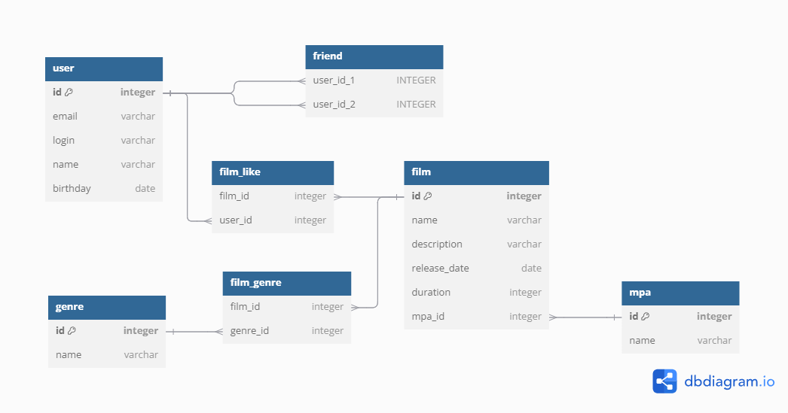

# java-filmorate
Template repository for Filmorate project.

# Структура базы данных


## Примеры запросов
### Фильмы
* Полуить фильм по id
```sql
SELECT * FROM "film" WHERE ID = 1;
```
* Добавить фильм
```sql
INSERT INTO "film" (name, description, release_date, duration, mpa_id) VALUES ('Название', 'Описание', '2021-01-02', 120, 1);
```

* Получить список самых популярных фильмов
```sql
SELECT f.ID, f.NAME, f.DESCRIPTION, f.RELEASE_DATE, f.DURATION, f.MPA_ID  FROM "film" f
INNER JOIN "film_like" fl ON fl.FILM_ID = f.ID
GROUP BY fl.FILM_ID
ORDER BY count(fl.FILM_ID) DESC
LIMIT ?
```

### Пользователи
* Получить пользователя по id
```sql
SELECT * FROM "user" WHERE ID = 1;
```
* Получить список пользователей
```sql
SELECT * FROM "user";
```
* Вернуть список друзей пользователя
```sql
SELECT * FROM "friend" WHERE USER_ID_1 = 1;
```

### Жанры
* Получить жанр по id 
```sql
SELECT * FROM "genre" WHERE ID = 1;
```
* Получить все жанры
```sql
SELECT * FROM "genre";
```

### Возрастной рейтинг
* Получить рейтинг по id
```sql
SELECT * FROM "mpa" WHERE ID = 1;
```
* Получить весь список рейтингов
```sql
SELECT * FROM "mpa";
```